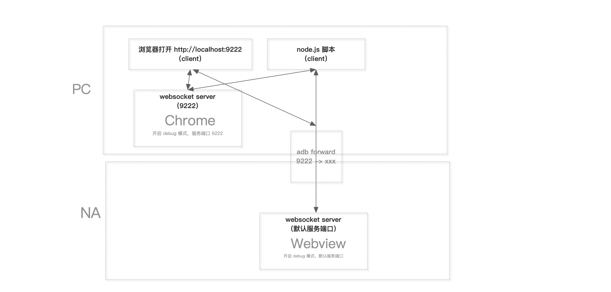

# 远程调试协议
> https://syang2forever.github.io/2018/01/30/Chrome%20%E8%BF%9C%E7%A8%8B%E8%B0%83%E8%AF%95%E5%8D%8F%E8%AE%AE%E4%B8%8D%E5%AE%8C%E5%85%A8%E6%8C%87%E5%8D%97/

### 概述

Webkit 定义了一套 Remote-Debugging-Protocol

Safari 和 Chrome 分别对它有扩展，但 Safari 无文档、不开放

而 Chrome 则开放了一套 Chrome DevTools Protocol

Chrome DevTools 项目基于 Chrome DevTools Protocol 开发

Chrome DevTools Protocol 也由 Chrome DevTools 项目的开发团队负责维护

### Chrome 远程调试架构图示

